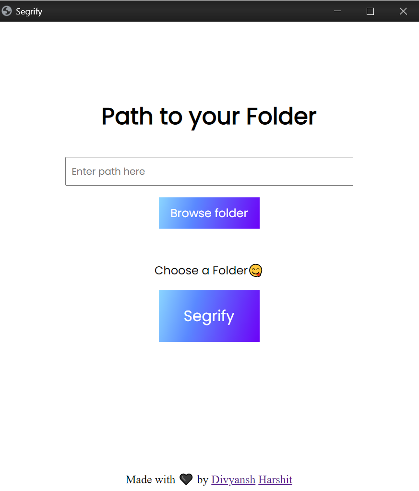

# Segrify

Segrify is a program to clean and organize your PC.



## Installation

Use the package manager [pip](https://pip.pypa.io/en/stable/) to install foobar.

```bash
pip install -r requirement.txt
```

## Usage
Browse to a folder or simply paste the path to your folder and click Segrify.

## License
[MIT](https://choosealicense.com/licenses/mit/)